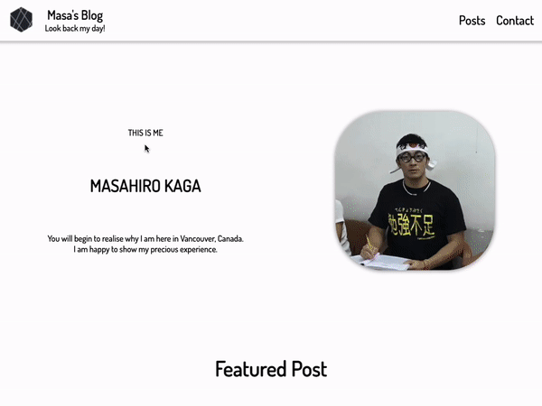
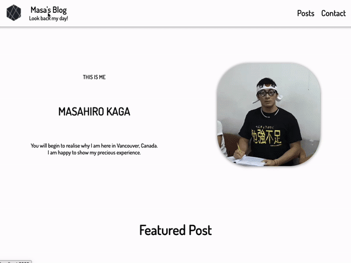

<h1 align="center">
Portfolio - Blog app
</h1>
<h3 align="center">
✏️ Always try to learn and write down what you learn📖
</h3>

<p align="right"> 
</img>
</img>

</p>

## URL

&emsp;[Blog app - https://portfolio-blog-app.vercel.app/](https://portfolio-blog-app.vercel.app/)

<br>

## Features

- Next.js.
- Emotion is used for styling.
- Set API for saving comment of visitors into database.
- Validation works.
- Fully responsive.

<br>

## Demo

<br>

1. Check blogs.
<div>
    
</div>
<br>

1. Send message to blog owner.
<div>
    
</div>
<br>

## Proud of
- Set API easily.
- Applied SPA and SSG.

<br>

## Usage

&emsp;On the terminal under "portfolio_nextjs-blog-app" folder, hit the command below to launch web page on your local environment.

```
npm run dev
```

<br>

## Deploy

- Vercel